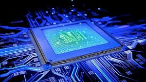

# 1. Concepto de Computador
Un computador es una máquina programable que procesa datos mediante hardware (parte física) y software (programas). Sus componentes principales incluyen la CPU, memoria y dispositivos de entrada/salida.

# 2. Arquitectura de Computadores
Se divide en dos principales tipos:
- **CISC (Complex Instruction Set Computing)**: Instrucciones complejas que pueden ejecutar múltiples operaciones en un solo ciclo. 
  - **Ejemplo**: *Intel Core, AMD Ryzen*.
- **RISC (Reduced Instruction Set Computing)**: Instrucciones simples y rápidas con mejor eficiencia energética. 
  - **Ejemplo**: *ARM (Apple M1/M2, Snapdragon), RISC-V, IBM POWER*.

  

# 3. Componentes Principales del Hardware
### **CPU (Unidad Central de Procesamiento)**
- **ALU (Unidad Aritmético-Lógica)**: Ejecuta operaciones matemáticas y lógicas.
- **Unidad de Control**: Coordina el flujo de datos en el procesador.
- **Registros**: Memoria ultrarrápida dentro de la CPU.
- **Buses**: Transportan datos, direcciones y señales de control.

### **GPU (Unidad de Procesamiento Gráfico)**
- Especializada en gráficos, renderización en 3D y cálculos en paralelo.
- Usada en videojuegos, inteligencia artificial y diseño gráfico.
#### Diferencias clave entre CPU y GPU

- **CPU**: Optimizada para tareas secuenciales, con unos pocos núcleos poderosos, ideal para ejecutar operaciones lógicas y de control.  
- **GPU**: Optimizada para tareas paralelas, con cientos o miles de núcleos pequeños, ideal para tareas gráficas y procesamiento de grandes volúmenes de datos.

### Tipos de Memoria
- **Registros**: Memoria más rápida dentro de la CPU.
- **Caché**: Memoria intermedia de alta velocidad (niveles L1, L2, L3).
- **RAM (Memoria Principal)**: Almacena temporalmente programas y datos en uso.
- **Memoria Secundaria**: HDD, SSD y unidades externas para almacenamiento permanente.

### Dispositivos de Entrada/Salida (E/S)
- **Entrada**: Teclado, mouse, escáner, micrófono.
- **Salida**: Monitor, impresora, altavoces.
- **Mixtos**: Pantallas táctiles, USB, impresoras multifunción.

### Buses de Datos
- **Bus de Datos**: Transporta información entre CPU, memoria y dispositivos.
- **Bus de Direcciones**: Indica la ubicación de los datos en la memoria.
- **Bus de Control**: Coordina las operaciones del sistema.

### 4. Software
- **Software de Sistema**: Gestiona los recursos del hardware (Sistemas operativos, drivers).
- **Software de Aplicación**: Programas para tareas específicas (*Microsoft Word, Chrome*).
- **Software de Desarrollo**: Herramientas para programadores (*IDEs, compiladores, Git*).

### 5. Procesos en el Encendido del Computador
1. **Encendido del Hardware**
2. **POST (Power-On Self-Test)**
3. **Carga del Bootloader**
4. **Inicio del Sistema Operativo**

### Procesamiento de Datos
Desde que se ingresa un dato en el teclado hasta que se muestra en la pantalla:
1. **Entrada** → Teclado envía señal eléctrica.
2. **Conversión** → Se traduce a código binario (ASCII/Unicode).
3. **Procesamiento** → La CPU ejecuta la operación.
4. **Salida** → Los datos se muestran en pantalla.

### Codificación de Datos
- **Binario**: Representa datos como 0 y 1.
- **ASCII/Unicode**: Codificación de caracteres.
- **RGB/CMYK**: Representación de imágenes.
- **IEEE 754**: Para números decimales.

### Unidades de Medida de Datos
| Unidad        | Símbolo | Equivalencia          |
|--------------|---------|----------------------|
| **Bit**      | (b)     | Unidad mínima (0 o 1) |
| **Byte**     | (B)     | 8 bits               |
| **Kilobyte** | (KB)    | 1,024 bytes          |
| **Megabyte** | (MB)    | 1,024 KB             |
| **Gigabyte** | (GB)    | 1,024 MB             |
| **Terabyte** | (TB)    | 1,024 GB             |
| **Petabyte** | (PB)    | 1,024 TB             |
| **Exabyte**  | (EB)    | 1,024 PB             |
| **Zettabyte**| (ZB)    | 1,024 EB             |
| **Yottabyte**| (YB)    | 1,024 ZB             |

## Referencias
- Wikipedia, "Computadora," Wikipedia, la enciclopedia libre, 5 de febrero de 2025. [En línea]. Disponible en: https://es.wikipedia.org/wiki/Computadora.
- J. L. Hennessy y D. A. Patterson, Computer Architecture: A Quantitative Approach, 6th ed. San Francisco, CA, USA: Morgan Kaufmann, 2017.
- D. A. Patterson y J. L. Hennessy, Computer Organization and Design: The Hardware/Software Interface, 5th ed. Morgan Kaufmann, 2013.
- J. D. Owens, M. Houston, D. Luebke, S. Green, and J. Stone, GPU Computing, Proceedings of the IEEE, vol. 96, no. 5, pp. 879-899, May 2008.
- A. S. Tanenbaum, Structured Computer Organization, 6th ed. Pearson, 2013.
- Wikipedia, "Dispositivo de entrada/salida," Wikipedia, la enciclopedia libre, 5 de febrero de 2025. [En línea]. Disponible en: https://es.wikipedia.org/wiki/Dispositivo_de_entrada/salida.
- W. Stallings, Operating Systems: Internals and Design Principles, 9th ed. Pearson, 2017.