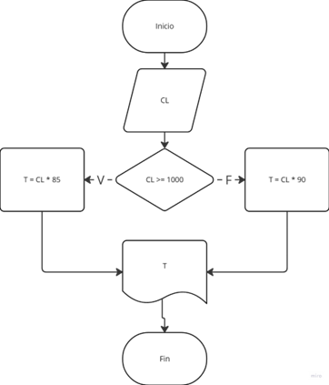
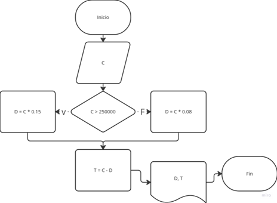

# Ejercicio 1  


# Ejercicio 2  
```
Inicio  

Leer ID, S1, S2, S3, S4, S5, S6  

ITS = S1 + S2 + S3 + S4 + S5 + S6  

PM = ITS / 6  

Imprimir: ID, ITS, PM  

Fin  
```
# Ejercicios
1. 
```
Inicio  

Leer CL  

Si CL >= 1000  
    T = CL * 85  
Sino  
    T = CL * 90  
Fin si

Imprimir T  

Fin  
```


2. 
```
Inicio  

Leer C  

Si C > 250000  
    D = C * 0.15  
Sino  
    D = C * 0.08  
Fin si  

T = C - D  

Imprimir: D, T  

Fin  
```


3. 
```
Inicio  

Leer A  

Si A >= 100  
    VA = 65.00  
Sino  
    Si A >= 50  
        VA = 70.00  
    Sino  
        Si A >= 30  
            VA = 95.00  
        Sino  
            VA = 4000.00 / A  
        Fin si  
    Fin si  
Fin si  

T = VA * A  

Imprimir: VA, T  

Fin  
```
# Actividad de evaluación
## Parte 1:

1. Una página web no es un algoritmo, pero sí puede contener algoritmos, ya que un algoritmo es una serie de pasos para resolver un problema.
2. Sí, una receta es un algoritmo porque hay que seguir unos pasos para completar la receta satisfactoriamente.
3. Sí, ya que se me están dando instrucciones a seguir.
4. Sí, porque me están dando el orden y los pasos a seguir para armar el mueble.
5. No, porque no hay un orden ni un proceso especificado, solo variables al azar.

## Parte 2:
1. Una constante porque su valor nunca cambia.
Una variable porque su valor cambia según el año actual.
2. Una variable porque la cantidad puede tomar diferentes valores.
3. Una constante porque su valor no cambia.
4. Una variable porque su valor depende del diámetro.

## Parte 3
1. No, porque debe haber una condición lógica que se cumpla para elegir la ruta.
2. Sí, consta de cumplir ciertos pasos y completar una tarea.
3. Sí, se le proveen dos variables y sigue los pasos para resolver el problema.
4. Sí, cuenta con un inicio y un final en la operación o tarea a realizar.

## Parte 4
1. Falso, el que usa símbolos es el diagrama de flujo.
2. Verdadero, el diagrama de flujo es una forma de ver el algoritmo de forma más gráfica.
3. Falso, el pseudocódigo no se escribe en un lenguaje de programación específico, pero sí utiliza términos generales para su creación.
4. Verdadero, la primera y última parte del diagrama de flujo corresponden al inicio y final.

## Parte 5
Las estructuras de control sirven para darle un flujo de ejecución específico a un algoritmo, por medio de la toma de decisiones, repitiendo acciones o controlando las secuencias en las que se ejecuta.

**Ejemplo 1**

Cuando estoy llevando mi día a cabo y en cierto momento me tengo que preguntar si estudio y después voy al gimnasio, o si voy al gimnasio y después estudio, cada una lleva a un flujo de acciones diferente.

**Ejemplo 2**

Cuando estoy decidiendo si voy a la universidad en moto o en metro y calculo qué me sale más barato teniendo en cuenta el tiempo y el precio.

Si me voy en metro pago 5 mil y me demoro una hora.
Si me voy en moto pago 7 mil y me demoro 20 minutos.

Entonces, calculo:

Son 2 mil pesos más, pero me ahorro 40 minutos.
Decido irme en moto.
Sin embargo, si la moto está más cara que eso, decido irme en metro.