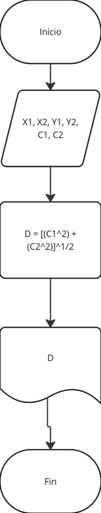
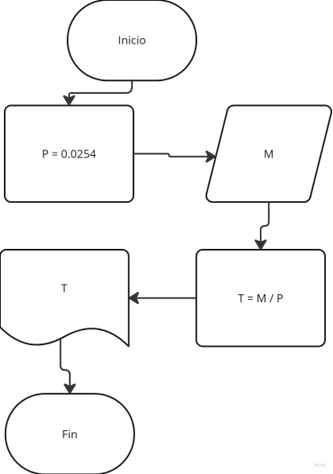
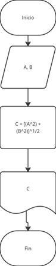

### Reto 1:
- **Entradas**: X1, X2, Y1, Y2, C1=(X2-X1), C2=(Y2-Y1)
- **Salidas**: D
- **Constantes**: 
- **Procesos**: D = [(C1^2) + (C2^2)]^1/2
```
Inicio  
Leer: X1, X2, Y1, Y2, C1, C2  
D = [(C1^2) + (C2^2)]^1/2  
Imprimir: D  
Fin
``` 

---

### Reto 2:
- **Entradas**: M (m)
- **Salidas**: T
- **Constantes**: P = 0.0254 (m)
- **Procesos**: T = M / P
```
Inicio  
Leer: M  
P = 0.0254  
T = M / P  
Imprimir: T  
Fin
```

---

### Reto 3:
- **Entradas**: A, B
- **Salidas**: C
- **Constantes**: 
- **Procesos**: C = [(A^2) + (B^2)]^1/2
```
Inicio  
Leer: A, B  
C = [(A^2) + (B^2)]^1/2  
Imprimir: C  
Fin
```

---

### Reto 4:
- **Entradas**: DN, MN, AN, DA, MA, AA
- **Salidas**: EA, FELIZ CUMPLEAÑOS
- **Constantes**: 1
- **Procesos**: AA - AN = EA
```
Inicio  
Leer: DN, MN, AN, DA, MA, AA  
EA = AA - AN  
Si MA < MN  
  EA = EA - 1  
Sino  
  Si MA = MN  
    Si DA < DN  
      EA = EA - 1  
    Sino  
      Si DA = DN  
        Imprimir: FELIZ CUMPLEAÑOS  
      Sino  
        Imprimir: EA  
      Fin si 
    Fin si 
  Fin si  
Fin si
Fin
```
---

### Reto 5:
- **Entradas**: VH, HT
- **Salidas**: SS
- **Constantes**: 50, 45, 40
- **Procesos**: 
  - SS = [(HT-45) * (VH*3)] + [(VH*2) * 5] + [40*VH ]  
  - SS = [(HT-40) * (VH*2)] + [40*VH ]  
  - SS = HT * VH
```
Inicio
Leer: VH, HT  
Si HT > 50  
  Imprimir: ERROR (No se puede trabajar más de 50 horas)  
Sino  
  Si HT > 45  
    SS = [(HT-45) * (VH*3)] + [(VH*2) * 5] + [40*VH]  
  Sino  
    Si HT > 40  
      SS = [(HT-40) * (VH*2)] + [40*VH]  
    Sino  
      SS = HT * VH  
    Fin si  
  Fin si  
Fin si 
Imprimir: SS  
Fin
```
---

### Reto 6:
- **Entradas**: C1, ..., CN
- **Salidas**: TC, TN, TP
- **Constantes**: 1
- **Procesos**: TC = TC + 1, TP = TP + 1, TN = TN + 1
```
Inicio  
Leer: N  
TC = 0, TN = 0, TP = 0  
VC = C1, ..., CN  
Para i = 1 hasta i = N  
  Leer: VC  
  Si VC = 0  
    TC = TC + 1  
  Sino  
    Si VC > 0  
      TP = TP + 1  
    Sino  
      TN = TN + 1  
    Fin si  
  Fin si  
Fin para  
Imprimir: TC, TN, TP  
Fin
```
---

### Reto 7:
- **Entradas**: 
- **Salidas**: AA, AD
- **Constantes**: 3
- **Procesos**: AD = AD * 3, AA = AA + AD
```
Inicio  
AA = 0, AD = 1  
Para i = 1 hasta i = 365  
  AD = AD * 3  
  Imprimir: AD  
  AA = AA + AD  
Fin para
Imprimir: AA  
Fin
```
---

### Reto 8:
- **Entradas**: A1,... , AN
- **Salidas**: PA, D, T
- **Constantes**: O.1, 0.12, 0.15
- **Procesos**: D = PA * 0.1, D = PA * 0.12, D = PA * 0.15, DT = DT + D, AT = AT + PA, T = AT - DT
```
Inicio  
Leer: N  
PA = A1, ..., AN; DT = 0, AT = 0  
Para i = 1 hasta i = N  
  Leer: PA  
  Si PA <= $100  
    D = PA * 0.1  
    Imprimir: PA, D  
  Sino  
    Si PA < $200  
      D = PA * 0.12  
      Imprimir: PA, D  
    Sino  
      D = PA * 0.15  
      Imprimir: PA, D  
    Fin si
  Fin si 
  DT = DT + D  
  AT = AT + PA  
Fin para
T = AT - DT  
Imprimir: T  
Fin
```